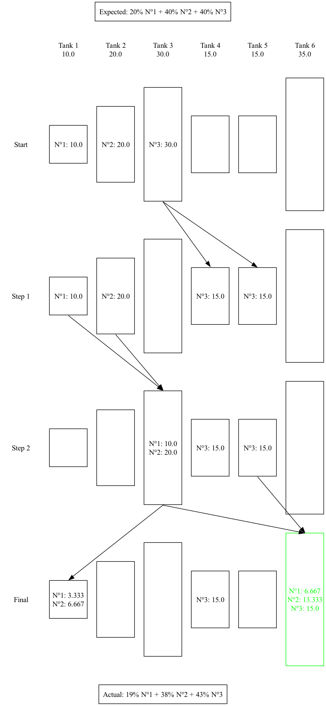

<hr>

<p align="center" style="font-weight: bold; font-size: 21px"> Krug Champagne Blending Software</p>
<p align="center" style="font-weight: bold; font-size: 18px"> Functional Specifications</p>


<hr>

<details>
<summary>Table of contents</summary>

- [Overview](#overview)
- [Scope](#scope)
- [Requirements](#requirements)
  - [Functional requirements](#functional-requirements)
  - [Non-functional requirements](#non-functional-requirements)
- [Use cases](#use-cases)
- [Data requirements](#data-requirements)
- [System architecture](#system-architecture)
- [Assumptions and dependencies](#assumptions-and-dependencies)
- [Acceptance criteria](#acceptance-criteria)
- [Glossary](#glossary)

</details>


# Overview

The goal of this project is to build software that can blend large quantities of wine in the right proportions to produce the closest result to the formula with the minimum number of steps. The software will focus on stage 4: Blending, and it will be used by the Cellar Master, Julie CAVIL, and her team.

# Scope

The scope of the project would be to create a software system that can assist in the blending process of Krug Champagne's new winery. The system should allow the Cellar Master and her team to input the desired formula for the champagne blend and then automatically calculate the optimal combinations of the wines in the various tanks to achieve the desired result. The system should also ensure that the tanks are never left partially full to avoid oxidation and contamination of the wine.

The system should be able to handle a large number of tanks and blends, and it should be designed to scale up or down as needed. The system should also be able to track the history of each tank, including the wine that has been stored in it, the dates it was filled and emptied, and any other relevant information.

In addition, the system should provide real-time feedback to the Cellar Master and her team as they adjust the blend, allowing them to see how changes in the proportions of different wines will affect the final result. The system should be user-friendly and intuitive, allowing the Cellar Master and her team to easily navigate and use its features.

Overall, the scope of the project is to create a comprehensive software system that streamlines the blending process, reduces errors, and ensures consistency in the final product.

# Requirements

The software should be able to blend wine from 330 tanks of various sizes in the right proportions to produce the closest result to the input formula.

The software should ensure that no tank is left partially full or partially empty due to the risk of oxidation.

The software should be written in a language that is fast and efficient.

The software should be able to produce the final product in the minimum number of steps possible.

The software should be able to produce the closest result to the input formula.

## Functional requirements

**The input and output method and format is subject to changes**

The software should take as input two text files with the following format:

`recipe.txt` (percentage of each wine in the formula):
```
20
40
40
```
`volumes.txt` (quantity that each tank hold in the same unit):
```
1250
2500
3750
1875
1875
4375
```
- it is requested that the amounts be integers or have a fixed number of decimal points (two), which will allow for precise equivalence computation and quicker checks when determining if tanks can be combined.
- We assume that the wines are present in the first tanks in the same order of the formula. (Here, wine N°3 starts at 37.5 volume units and must be present at 40%)
- The decimal separators must be a dot `.` and not a comma `,`.
- The program should give the user an error message if the formula percentages do not add up to 100% or if there are more wines than tanks.
- *If time allows it, the optional usage of volume units may be added.*

The software should return two text files containing the following informations:
- The closest resulting formula from the required one and the steps to achieve it
- *If time allows it, the formula generating the less waste and the steps to achieve it*
- *If time allows it, a formula that consiliates conformity of the desired formula and steps to achieve it*
- The values should be given with up to 3 decimals

`result.txt` (percentage of each wine in the resulting formula):
```
19.048
38.095
42.857
```
`steps.txt` (connections to be made for each step):
```
3 -> 4
3 -> 5

1 -> 3
2 -> 3

3 -> 1
3 -> 6
5 -> 6
```

<!--
  Note: A possible JSON format for both inputs and outputs has been defined as well.
  The text version will be used to keep things simpler to implement.
-->

(Here is the same example but visualized:)


The software should be a console application working only with text. *If time allows it, an API and even a GUI might be implemented.*

The software should be able to calculate the best combination of tanks to use based on the input formula and the available wine in the tanks.

The software should be able to generate a report on the blending process, including the number of steps taken, the quantity of wine used from each tank, and the final product's characteristics.

## Non-functional requirements

The software should be highly secure to prevent unauthorized access to the system.

The software should be highly reliable to ensure that there are no crashes or errors during the blending process.

The software should be scalable to handle a large number of tanks and blending combinations.

The software should be written in a language that is easy to maintain and update.

The software should be highly performant to ensure that the blending process is completed in a reasonable amount of time.

# Use cases

Create a new blend: The Cellar Master or another authorized user can create a new blend by selecting the desired wines from the available inventory and specifying their proportions. The software should ensure that the selected tanks are completely full and not in contact with oxygen.

Export blend recipe: The authorized users can export the formula and proportions of a blend to a file or print it for record keeping or sharing with other parties.

# Data requirements

Tank data: information about the various tanks available for blending, including their sizes, contents, and previous use history.

Blending data: data on the different blends created during the testing phase, including their ingredients and proportions, as well as notes from the tasting team.

Formula data: the final formula for the Krug Grande cuvée, including the ingredients and proportions.

Production data: records of each batch produced, including the tanks used, their contents, and the blending process.

All of this data will need to be stored in a central database that can be accessed by the blending software to ensure accurate and efficient production.

# System architecture

Blending Engine: The blending engine is the core component of the system, responsible for calculating the optimal blend based on the input formula and the available wine stored in the tanks. It uses algorithms and data structures to find the minimum number of steps to produce the closest result to the input formula.

Infrastructure: This component includes the hardware and software required to host the system. It could be hosted on-premises or in the cloud, depending on the requirements of the organization.

Overall, the system architecture should be scalable, flexible, and modular to accommodate future changes and updates to the software. It should also be designed with performance and reliability in mind to ensure that it can handle the complex calculations and data management tasks required for the blending process.

# Assumptions and dependencies

The tanks are reusable and can be used several times in the blending process.

The system of pumps and pipes can connect any tank with any other tank.

The input formula will not change during the blending process.

The software will only be used by the Cellar Master and her team.

# Acceptance criteria

The software should be able to receive the wine blending formula from the Cellar Master, Julie CAVIL, as input.

The software should be able to calculate the optimal blending ratio of wines in the different tanks to achieve the closest possible result to the input formula.

The software should be able to output a detailed plan for blending the wines in the tanks to achieve the optimal ratio, including which tanks to use and in what order, and how much wine to transfer between the tanks.

The software should ensure that no tank is left partially full or empty at any point in the blending process to prevent oxidation of the wine.

*The software should be able to track the progress of the blending process and provide real-time feedback to the user.*

The software should ensure that the final product meets the input formula as closely as possible.

The software should be easy to use and understand, with clear and concise documentation provided.

The software should be efficient, with a minimum number of steps required to achieve the optimal blending ratio, and with a reasonable runtime.

# Glossary

Krug Champagne: a brand of champagne that is part of the LVMH group.

Winery: a facility where wine is made.

Méthode champenoise: a traditional method of making champagne that involves a complex process of fermentation and aging.

Harvesting: the process of picking grapes from the vine.

Pressing: the process of extracting juice from the grapes.

Fermentation: the process by which yeast converts sugar into alcohol.

Still wine: wine that does not contain carbon dioxide bubbles.

Blending: the process of mixing different wines together to create a consistent flavor profile.

Second fermentation: the process by which carbon dioxide bubbles are created in champagne.

Lees: dead yeast cells that settle at the bottom of the bottle during aging.

Riddling: the process of gradually rotating and tilting champagne bottles to move the lees towards the neck of the bottle.

Disgorgement: the process of removing the frozen plug of lees from the neck of the bottle.

Dosage: the process of adding a mixture of wine and sugar to adjust the sweetness level of the champagne.

Cellar Master: the person responsible for managing the winemaking process.

Tanks: containers used for storing and blending wine.

Pumps and pipes: equipment used for transferring wine between tanks.

Oxidation: the process by which wine is exposed to oxygen, which can change its flavor and aroma.

Formula: the specific combination of wines and proportions used to create a desired flavor profile.

